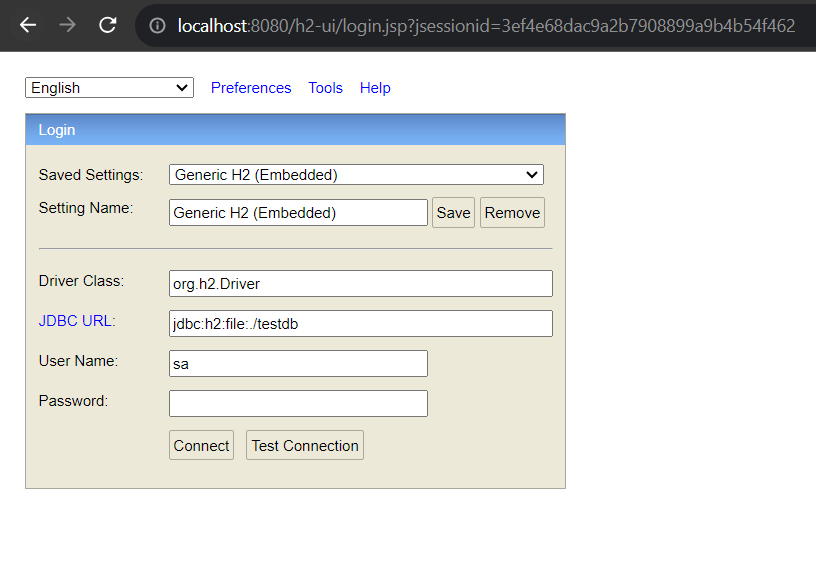

# Spring Security Refresh Token with JWT in Spring Boot example (HttpOnly Cookie)

## Auth Controllers with JSON examples:  
Email field will be used as username.

> Register PATH : /api/auth/signup  
> ```json  
>{
>    "email" : "l.rossi@gmail.com",
>    "password" : "123456789",
>    "role" : "ROLE_USER"
>}
>  ```  

> Log in PATH : /api/auth/signin 
> ```json  
>{
>    "email" : "l.rossi@gmail.com",
>    "password" : "123456789"
>}
>  ```  
   
> Log out PATH (No JSON) : /api/auth/signout  

> Refresh Jwt Token PATH (No JSON) : /api/auth/refreshtoken 

## Access H2 Database :  
Search localhost:8080/h2-ui, insert credentials and connect  




## Dependencies:  
> SpringBoot 3.1.0  
> Data JPA 3.1.0  
> Spring Security 6.1.0  
> JasonWebToken 0.11.5  
> H2 Database 2.1.214  


Credits to : [BezKoder](https://www.bezkoder.com/)

[Spring Security Refresh Token with JWT](https://www.bezkoder.com/spring-security-refresh-token/)
